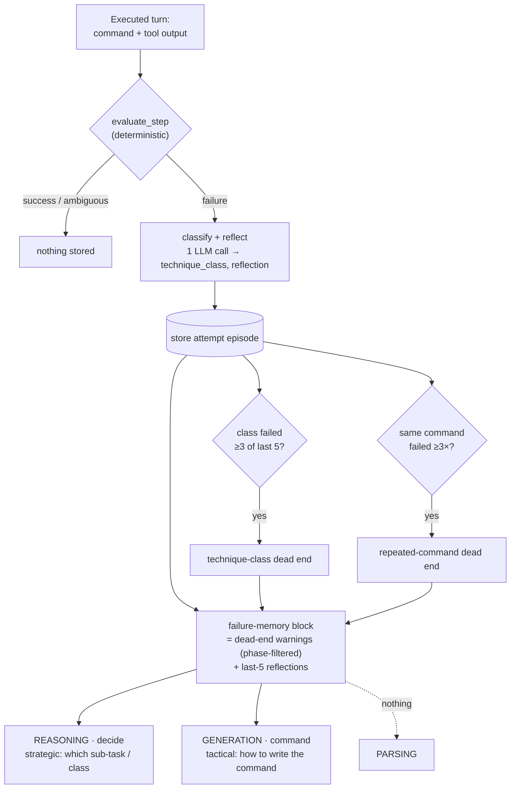

## 2. The table (in `final_report_logs/LOOP_METRICS.md`)

**Headline — `max_repeat` (worst-loop length), for your poster graph:**

|Challenge|Category|n|vanilla|FAEM|reduction|
|---|---|---|---|---|---|
|Permuted|crypto|3|12.7 (14,7,17)|6.0 (5,7,6)|**53%**|
|network-tools|pwn|1|6|2|**67%**|
|Crushing|rev|1|7|2|**71%**|

The file also has a **per-run detail table** (max_repeat, repeated-commands, dup_rate, unique, commands, dead_ends) so you can graph whichever metric fits the poster — `max_repeat` for "worst loop," or `repeated`/`dup_rate` for "total wasted attempts."
 
---

## The shared machinery

FAEM lives in [memory/faem.py](vscode-webview://12sd1g9jn05jeoelk9thimelm0ci8tf47l4hhbvdftk4j9891gq6/memory/faem.py) as `FAEMMemory`, a `BaseMemory` with three methods that matter at runtime:

- **`after_turn(messages)`** — ingests the just-executed command + raw output, runs the deterministic `evaluate_step` failure detector (flag found / HTTP error / tool failure / SQL error / auth failure / empty output), and for each detected failure calls `_generate_reflection` (one LLM call that returns `{technique_class, reflection}`) and stores a `FailureMemoryEntry` with `episode_type="attempt"`.
- **`_maybe_promote_dead_end()`** — after each attempt, checks whether `latest_class` appears ≥ `DEAD_END_THRESHOLD` (3) times within the last `DEAD_END_WINDOW` (5) failures; if so, promotes it to an `episode_type="dead_end"` entry with a synthesized "this whole class is exhausted" reflection.
- **`before_turn(phase)`** — renders the "DEAD END TECHNIQUES — DO NOT ATTEMPT" block, phase-filtered.

Two flags on the constructor gate behavior:

- `live_promotion` (default `True`): when `False`, `after_turn` still records attempt entries but never calls `_maybe_promote_dead_end` ([faem.py:459](vscode-webview://12sd1g9jn05jeoelk9thimelm0ci8tf47l4hhbvdftk4j9891gq6/memory/faem.py#L459)).
- `load_seed(entries)`: appends already-promoted dead-end entries, rejecting anything that isn't `episode_type="dead_end"` ([faem.py:475-494](vscode-webview://12sd1g9jn05jeoelk9thimelm0ci8tf47l4hhbvdftk4j9891gq6/memory/faem.py#L475-L494)).

## Where it hooks into the agent loop

The three-module PentestGPT agent wires FAEM through `ReasoningModule` only. `PentestGPTAgent.__init__` passes `memory_variant`, `live_promotion`, and `seed_entries` down ([orchestrator.py:66-72](vscode-webview://12sd1g9jn05jeoelk9thimelm0ci8tf47l4hhbvdftk4j9891gq6/pentestgpt/orchestrator.py#L66-L72)). In [reasoning.py:81-87](vscode-webview://12sd1g9jn05jeoelk9thimelm0ci8tf47l4hhbvdftk4j9891gq6/pentestgpt/reasoning.py#L81-L87), memory is instantiated **only** for variants `"faem"` and `"faem_seeded"` — everything else leaves `self.memory = None`, keeping the decide prompt byte-identical to the baseline.

Each `run_turn` cycle:

1. Infers the current phase from the just-executed sub-task + command ([reasoning.py:145](vscode-webview://12sd1g9jn05jeoelk9thimelm0ci8tf47l4hhbvdftk4j9891gq6/pentestgpt/reasoning.py#L145)).
2. **Ingest** — if memory is active and there was a command/output, calls `after_turn` via `_build_faem_messages`, which shapes the turn into the assistant-tool-call + tool-result schema the detector expects ([reasoning.py:154-157](vscode-webview://12sd1g9jn05jeoelk9thimelm0ci8tf47l4hhbvdftk4j9891gq6/pentestgpt/reasoning.py#L154-L157), [270-286](vscode-webview://12sd1g9jn05jeoelk9thimelm0ci8tf47l4hhbvdftk4j9891gq6/pentestgpt/reasoning.py#L270-L286)).
3. **Inject** — at the decide step, `_decide` calls `_faem_decide_block()` and splices it into the prompt ([reasoning.py:250-252](vscode-webview://12sd1g9jn05jeoelk9thimelm0ci8tf47l4hhbvdftk4j9891gq6/pentestgpt/reasoning.py#L250-L252)). That block combines `before_turn`'s dead-end warnings (phase-filtered) with a summary of the most recent failed attempts ([reasoning.py:288-320](vscode-webview://12sd1g9jn05jeoelk9thimelm0ci8tf47l4hhbvdftk4j9891gq6/pentestgpt/reasoning.py#L288-L320)).

## Live faem runs (`--memory_variant faem`)

- Constructed with `live_promotion=True` (default via `_resolve_live_promotion` since the variant isn't `faem_seeded`), **no** seed entries.
- Memory starts empty. It fills up **within a single task** as the agent acts: attempts accumulate, and once a technique class fails 3-of-5 times, it's promoted to a dead end that then gets surfaced back into the decide prompt.
- Everything is intra-task and ephemeral — `reset()` clears it, and nothing persists across tasks.

## Seeded faem runs (`--memory_variant faem_seeded`)

This is the cross-task memory-transfer experiment path.

- **Offline build**: `scripts/build_seed_memory.py` replays completed seed-task logs, classifies each _whole failed trajectory_ once via `FAEMMemory._generate_reflection`, and writes `seed_memory/seed_dead_ends.json` — a `{metadata, entries}` file where every entry is already a promoted `dead_end` carrying `source_task_id`/`source_subtask_id` provenance.
- **Load at run start**: the harness requires `--seed_file`, calls `read_seed_file` to deserialize, and asserts the eval task is **not** one of `metadata.seed_task_ids` (`_load_and_assert_seed`, [run_experiment.py:397-416](vscode-webview://12sd1g9jn05jeoelk9thimelm0ci8tf47l4hhbvdftk4j9891gq6/harness/run_experiment.py#L397-L416)) — seed and eval sets must be disjoint or the measurement is contaminated. The entries flow through `seed_entries` → `ReasoningModule` → `memory.load_seed()`.
- **`live_promotion` defaults to `False`** for this variant ([run_experiment.py:392-394](vscode-webview://12sd1g9jn05jeoelk9thimelm0ci8tf47l4hhbvdftk4j9891gq6/harness/run_experiment.py#L392-L394)): the run still _records_ new attempt failures (for later before/after analysis) but never promotes new dead ends, so the only dead ends surfaced during the eval are the offline-seeded ones — otherwise a fresh live promotion would confound the transfer measurement.

So the two modes differ in exactly two knobs: **seeded** starts with pre-built cross-task dead ends and freezes promotion; **live** starts empty and promotes as it goes. Both share the identical ingest → detect → reflect → inject pipeline. (`harness/run_batch.py` just fans these same `--seed_file`/`--live_promotion` args out across a task list, re-checking disjointness before launching.)

One note: the four-variant factory table at [run_experiment.py:54-59](vscode-webview://12sd1g9jn05jeoelk9thimelm0ci8tf47l4hhbvdftk4j9891gq6/harness/run_experiment.py#L54-L59) and `_build_seeded_faem` construct memory directly, but in the actual orchestrated run the memory is built inside `ReasoningModule` from the config — so the factory/`_build_seeded_faem` path is the harness-level plumbing that resolves `seed_entries` and `live_promotion` into the config that the orchestrator then uses.

---

**What's accurate:** classify → store → promote-on-repeat; Parsing gets nothing; memory only on a failure.

**What's not:** in the current implementation Reasoning and Generation **receive the same combined block** — not a strategic block to one and a tactical reflection to the other. The block that gets built (`_faem_decide_block`) always contains _both_ parts (dead-end warnings **and** the last-5 reflections), and `orchestrator._generation_node` forwards that whole block into Generation. So the strategic/tactical distinction is in **what each module does with it** (its role), not in **which payload it gets**. Everything else in your framing holds.

Here's a poster-accurate rewrite:

---

### Methodology — Failure-Aware Episodic Memory (FAEM)

**Write (only on a failed turn).** Each executed turn's command + tool output is scored by a deterministic evaluator (`evaluate_step`); successful or ambiguous turns write nothing. A failure triggers one structured LLM call returning `{technique_class, reflection}`, stored as an _attempt_ episode. Two promotion rules then run: a **technique-class dead end** fires when a class has failed ≥3 of the last 5 failed attempts; a **repeated-command dead end** fires when the same command has failed ≥3 times.

**Inject (before the next turn).** FAEM assembles one _failure-memory block_ — (i) active **dead-end warnings** (technique-class entries filtered to the current phase; command-loop entries always shown) and (ii) the **last 5 failed attempts** with their one-line reflections — and prepends it to the prompts of two of the three modules:

- **Reasoning (sub-task selection)** — uses it _strategically_: stop re-selecting an exhausted technique class.
- **Generation (command writing)** — uses it _tactically_: fix the concrete command ("heredoc not closed → use `python3 -c`").
- **Parsing** — receives nothing.

**Selective** therefore means three things: _temporal_ (memory exists only after a failure), _module_ (Reasoning + Generation, never Parsing), and _phase_ (technique-class dead ends surface only in their matching phase).

---

### Diagram (the arrow part)

ASCII (drop-in for a poster):

```
  ── WRITE (only on a failed turn) ─────────────────────────────
    command + tool output
          │
          ▼
     evaluate_step ──(success / ambiguous)──▶  nothing stored
     (deterministic)
          │ failure
          ▼
     classify + reflect   (1 LLM call → technique_class, reflection)
          │
          ▼
     store attempt episode
          ├─ class failed ≥3 of last 5 ───▶ promote technique-class dead end
          └─ same command failed ≥3× ─────▶ promote repeated-command dead end

  ── INJECT (before the next turn) ─────────────────────────────
    failure-memory block = dead-end warnings (phase-filtered)
                         + last-5 failed attempts w/ reflections
          │
          ├───────────▶  REASONING · decide     (strategic: which sub-task / class)
          ├───────────▶  GENERATION · command   (tactical: how to write the command)
          └──   ✗   ───▶  PARSING                (nothing)
```

Mermaid (if your poster tool renders it):



---

Two options from here:

1. **Keep the code, present it accurately** (above) — both modules get the full block; the roles differ.
2. **Make the code match your cleaner split** — filter so Reasoning gets only the dead-end block and Generation gets only the reflection line. That's a small, well-scoped change and it would make the strategic/tactical separation literally true (and arguably a better design — less token bloat in each prompt). Say the word and I'll implement + re-verify.

Want me to drop this methodology text + diagram into a `METHODOLOGY.md` (or into `final_report_logs/`) so it's alongside the rest of the poster material?

---

## Results to include:
1. FAEM loop reduction in percentages


One Permuted run per arm, turns 1 → 40 left to right.

Dark = most-repeated command (broken heredoc);

mid = other repeats; light = one-off commands.